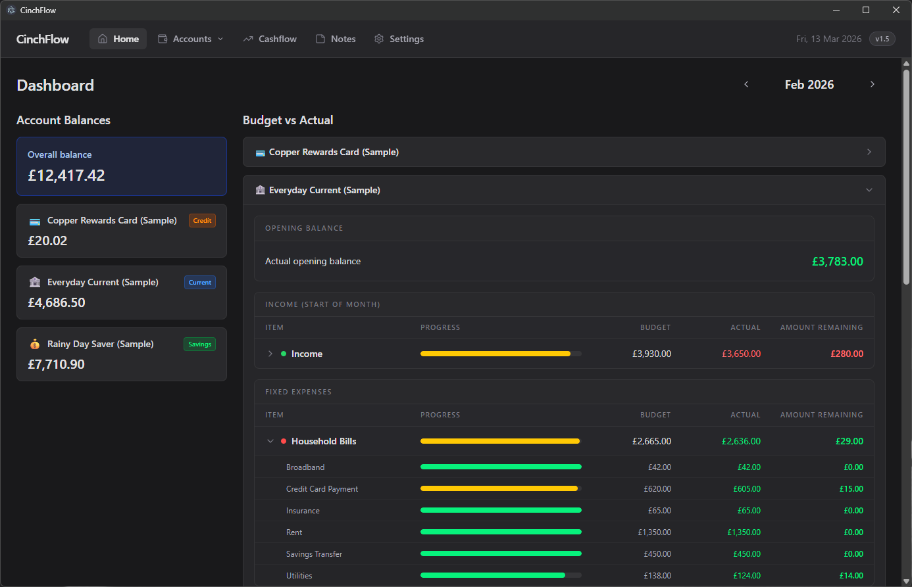
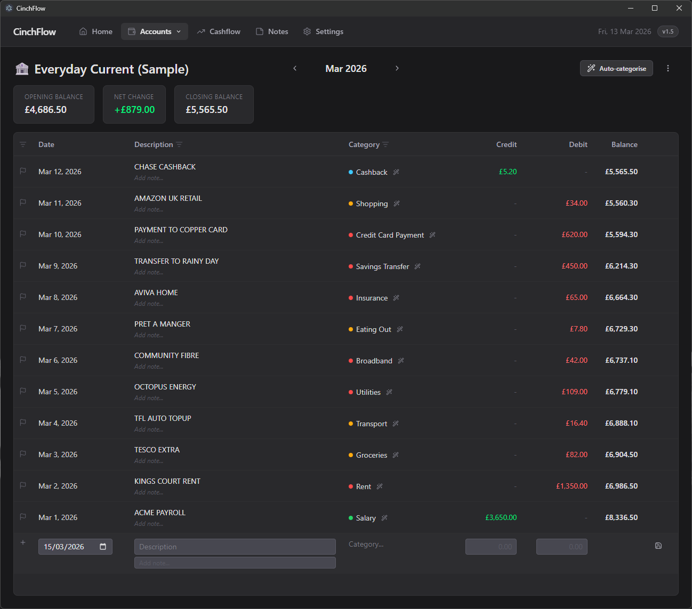
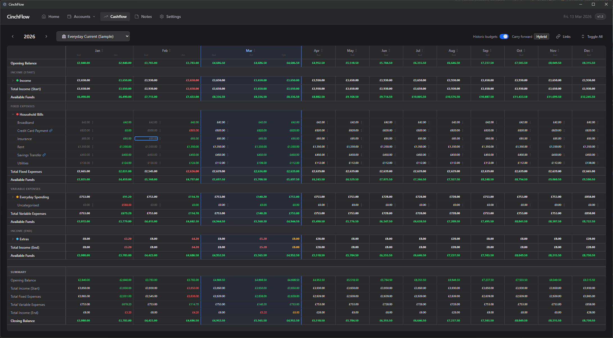

# CinchFlow

CinchFlow is a desktop personal finance application for budgeting, transaction tracking, and cashflow forecasting.



It combines a month-scoped transaction register with a forward-looking spreadsheet like cashflow planner, import tools, rules-based categorisation, notes, and settings for managing account structure. 




The project is open source and was started as an experiment to benchmark AI-assisted development in a real-world, relatively complex application. Most of the code in this repository was written by either Claude (Opus 4.6) or GPT (5.4).

Because the app deals with personal financial information, it is private by design. The full source is available, you can build it locally, it runs locally on your machine, it does not store your data in the cloud, and it does not directly interface with your bank.

This work is associated with [brookhaus.co.uk](https://brookhaus.co.uk).

## Why it exists

CinchFlow explores whether modern AI agents can help design, refactor, and maintain a non-trivial desktop application with:

- multiple financial workflows
- feature-specific renderer architecture
- Electron main/preload/renderer boundaries
- local persistence
- import pipelines for bank statement formats

The result is a usable application first, and also a public reference point for AI-assisted software delivery. I'm not suggesting this is by any means a reference implementation or the best way to go about agentic development, it's really my first attempt at end to end development with heavy AI assistance, so it's a reference of sorts!

## What it does

Core product areas:

- Dashboard: account balances and monthly budget progress
- Transaction register: month-by-month transaction entry, inline editing, filtering, imports, auto-categorisation, and quick rules
- Cashflow: yearly budget planning, actuals, hybrid carry-forward modes, comments, linked categories, and drilldown
- Settings: account management, category and header management, categorisation rules, data import/export, and PIN settings
- Notes: lightweight note-taking inside the app

## Key features

- Desktop app built with Electron for local-first use
- Multiple account types including current, savings, and credit
- Monthly register with running balances calculated from the full ledger
- Inline row editing with keyboard navigation
- Import support for CSV and OFX/QFX formats
- Duplicate-aware imports using external transaction IDs
- Auto-categorisation based on saved rules
- Cashflow planning across a full year with budget, actual, and hybrid views
- Category linking across accounts for cashflow visibility
- Local SQLite storage with backup and restore support

## Stack

- Electron
- Electron Forge
- Vite
- React
- TypeScript
- Tailwind CSS v4
- Zustand
- better-sqlite3
- React Router

## License

The source code is licensed under the MIT License. See [LICENSE.md](./LICENSE.md).

Branding is separate from the code license. The `CinchFlow` name, logos, icons, and official store assets are reserved. See [TRADEMARKS.md](./TRADEMARKS.md).

## Running locally

Prerequisites:

- Node.js 20+ recommended
- npm
- Windows is the most tested environment in the current setup

Install dependencies:

```bash
npm install
```

Start the desktop app in development mode:

```bash
npm start
```

Useful checks:

```bash
npm run lint
npm run test:cashflow
npm run test:register
```

Type-check the whole app:

```bash
npx tsc --noEmit
```

## Building local installers

Create a packaged build using the current app version:

```bash
npm run make
```

Important build note:

- `npm run make` packages using the version already in `package.json`
- `npm run make:next` increments the minor version before packaging
- version display uses `major.minor`
- package metadata stays semver-compatible as `major.minor.0`
- the version is stamped into the UI, installer, and executable naming

Example:

- current package version `1.0.0`
- `npm run make` keeps the build at `1.0.0`
- `npm run make:next` prepares `1.1.0`
- the UI and build artifacts display `1.1`

If you only want a packaged app folder without running all makers:

```bash
npm run package
```

## Routes and product surfaces

- `/` dashboard
- `/accounts/:accountId/:year/:month` transaction register
- `/cashflow/:year/:accountId` cashflow planner
- `/settings` settings and administration
- `/notes` notes

The renderer uses `HashRouter`, which keeps routing simple for desktop packaging.

## Logical architecture

At a high level, the application is split into four layers:

```text
Electron main process
  -> owns IPC handlers, services, repositories, DB access, import processing

Electron preload
  -> exposes a typed safe API to the renderer via window.api

Renderer
  -> React UI, feature controllers, view models, components, local interaction state

Shared
  -> DTOs, constants, IPC channel names, shared helpers
```

Typical interaction flow:

```text
React component
  -> feature controller hook
  -> window.api.* preload call
  -> IPC handler in main
  -> service / repository / DB
  -> typed response back to renderer
  -> pure view-model builder
  -> feature components render result
```

## Source layout

```text
src/
  main/
    db/               SQLite connection and migrations
    import-handlers/  Bank/file format parsers
    ipc/              Electron IPC handlers
    repositories/     Persistence-oriented data access
    services/         Feature/domain services
  preload/
    preload.ts        Typed renderer API surface
  renderer/
    components/       Shared UI and cross-feature components
    features/
      cashflow/       Cashflow feature
      register/       Transaction register feature
    hooks/            Cross-feature hooks
    lib/              Renderer utilities
    routes/           Thin route shells
    stores/           Zustand stores
  shared/
    channels.ts       IPC channel names
    constants.ts      Shared constants
    types.ts          Shared DTOs and entity types
```

Other important files:

- `forge.config.ts`: Electron Forge configuration and maker setup
- `scripts/prepare-make-version.cjs`: auto-increment version script used during `make`
- `package.json`: scripts and app metadata

## Feature architecture

### Transaction register

The register is structured around a thin page, a controller, data/workflow hooks, and a table model:

```text
AccountRegisterPage
  -> useRegisterController
    -> useRegisterData
    -> useRegisterFilters
    -> useRegisterWorkflows
  -> RegisterTable
    -> RegisterTableHeader
    -> TransactionRow
    -> NewTransactionRow
  -> RegisterDialogs
```

Key ideas:

- route parameters define account, year, and month scope
- `useRegisterData` owns authoritative register data loading and safe local patching
- `buildRegisterViewModel(...)` derives running balances and filtered rows
- row editing is isolated in `useTransactionRowEditing(...)`
- import, quick-rule, and auto-categorise flows are controller-owned side workflows

### Cashflow

The cashflow feature is structured similarly:

```text
CashflowPage
  -> useCashflowController
    -> useCashflowCalculations
    -> useCashflowCellEditing
    -> useCashflowOperations
  -> CashflowTable
    -> CashflowRowRenderer
    -> row-specific components
```

Key ideas:

- cashflow loads through a single typed table-data query
- pure builders derive the calculation model and row model
- page components are kept thinner than the original route-based implementation
- focused cell and row components replace hidden render-helper logic

## Component interactions

The current renderer direction is:

- routes should be thin shells
- feature pages should compose controller hooks and feature components
- controller hooks should orchestrate loading, refresh, mutation rules, and workflow state
- pure builder modules should derive data for rendering
- table/row/cell components should focus on rendering and direct UI interaction

This pattern matters because the two most complex areas, cashflow and register, were explicitly refactored to be easier for both humans and AI agents to understand.

## Data and persistence

- SQLite is used as the local database
- migrations live in `src/main/db/migrations`
- repositories handle persistence concerns
- services coordinate feature logic
- IPC handlers stay thin and convert service/repository results into renderer-safe responses

Examples:

- `cashflow-query-service.ts` composes cashflow read data
- `register-query-service.ts` composes register view data
- `import-service.ts` handles duplicate detection and optional auto-categorisation for imports

## Import handler architecture

Adding a new import handler is one of the most common extension points in this app.

Relevant files:

- `src/main/import-handlers/types.ts`
- `src/main/import-handlers/index.ts`
- `src/main/ipc/import-handlers.ts`
- `src/main/services/import-service.ts`

### How the import pipeline works

```text
ImportWizardDialog
  -> window.api.import.getHandlers()
  -> user selects a handler
  -> window.api.import.transform(accountId, handlerName, fileContent, autoCategorise)
  -> main IPC import handler
  -> selected import handler parses raw file into TransactionWithCategory[]
  -> importService.prepareImport(...)
    -> duplicate detection using external_id
    -> optional auto-categorisation against saved rules
  -> renderer shows preview
  -> window.api.import.process(...)
  -> importService.processImport(...)
```

### The handler contract

Each import handler implements:

```ts
export interface IImportHandler {
  systemName: string;
  title: string;
  processFile(content: string): TransactionWithCategory[];
}
```

### Steps to add a new handler

1. Create a new file in `src/main/import-handlers/`, for example `my-bank-csv-handler.ts`.
2. Export an `IImportHandler` implementation.
3. Parse the incoming file into `TransactionWithCategory[]`.
4. Leave database-owned fields empty or neutral for preview data:
   - `id`
   - `account_id`
   - `created_at`
   - `updated_at`
   - `import_id`
5. Set `category_*` fields to `null` unless the source file genuinely provides mapped categories you want to trust.
6. Generate a stable `external_id` whenever possible so duplicate detection works reliably.
7. Register the handler in `src/main/import-handlers/index.ts`.
8. Run the app, open Import, and verify preview, duplicate detection, and final import behavior.

### Good handler practices

- Prefer deterministic parsing over heuristic guessing
- Normalize signs carefully so credits and debits map to `delta_value` correctly
- Preserve the original transaction description as faithfully as possible
- Generate a stable `external_id` from bank-provided identifiers where available
- Fall back to generated IDs only when the source format has no durable transaction ID
- Return an empty array instead of throwing when a file is malformed in an expected way

### Existing examples

- `basic-csv-handler.ts`
- `capital-one-csv-handler.ts`
- `ofx-handler.ts`

## Development notes

- The codebase intentionally favors typed IPC contracts over loose message passing
- Cashflow and register now use feature folders and controller/view-model patterns
- Build versioning is automated during `npm run make:next`
- The app is local-first and currently centered around personal finance workflows, not cloud sync

## Suggested first places to read

If you are new to the codebase, start here:

- `src/renderer/App.tsx`
- `src/renderer/components/layout/Navbar.tsx`
- `src/main/index.ts`
- `src/preload/preload.ts`
- `src/shared/types.ts`
- `src/renderer/features/register`
- `src/renderer/features/cashflow`
- `src/main/import-handlers`

## Project status

This repository is both:

- a usable desktop finance app
- a public case study in AI-assisted software engineering

If you use it, fork it, extend it, or just read through it for architecture ideas, that is exactly the point.
